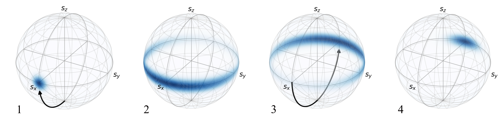

# QuTip-Density-Bloch-Sphere

An extension of python's QuTip Library to plot density functions and arrows on the surface of the Bloch Sphere. 
Quite useful to represent squeezed states or general evolution of quantum states.

